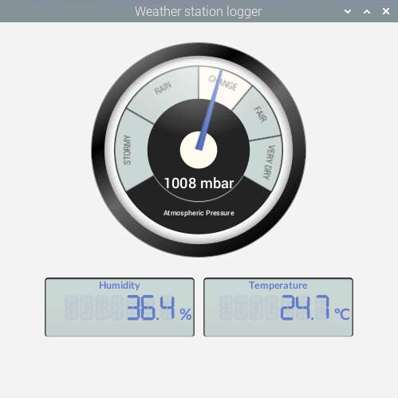

# Weather station project

This project is a demonstration of an IoT weather station logger which integrates into the [ArcGIS platform](https://www.esri.com/en-us/arcgis/products/arcgis-platform/overview). It was featured in this [blog post](https://www.esri.com/arcgis-blog/developers/) which gives more details of the developer technology used for this project.

It has been designed to work on a Raspberry Pi Model 3B+ (or higher model) with a USB GPS receiver.

The project uses an early adopter version of the ArcGIS Maps SDK for Java specifically compiled to work with Arm Linux platforms such as the Raspberry Pi or Jenson Orin units. The Java Maps SDK with support for Arm Linux can be requested by emailing ARM64LinuxNative@esri.com. This will install the libraries needed for this app in a Maven Local instance. This is a temporary way of getting the SDK whilst it is in Beta. Subsequent releases will be available in a public maven repository.

The project includes the Gradle wrapper, so there is no need to install Gradle to run the app.

## Instructions

1. Set up your Raspberry Pi by following the [instructions](Raspberry%20Pi%20Setup.md) in this page.
2. Create a dev directory in your home directory using the command line: mkdir dev
3. Open the directory by entering `cd dev`
4. Clone the repository by entering `git clone https://github.com/mbcoder/weather-station.git`
5. Move into the project directory `cd weather-station`
6. The app can be run by entering sudo ./gradlew run

Note that the application needs to be run using sudo so that the Pi4J libraries have sufficient permission to access the Raspberry Pi hardware.

## Resources

* [ArcGIS Maps SDK for Java](https://developers.arcgis.com/java/)  
* [ArcGIS Blog](https://www.esri.com/arcgis-blog/developers/)  
* [Esri Twitter](https://twitter.com/arcgisdevs)  

## Issues

Find a bug or want to request a new feature?  Please let us know by submitting an issue.

## Contributing

Esri welcomes contributions from anyone and everyone. Please see our [guidelines for contributing](https://github.com/esri/contributing).

## Licensing

Copyright 2023 Esri

Licensed under the Apache License, Version 2.0 (the "License"); you may not 
use this file except in compliance with the License. You may obtain a copy 
of the License at

http://www.apache.org/licenses/LICENSE-2.0

Unless required by applicable law or agreed to in writing, software 
distributed under the License is distributed on an "AS IS" BASIS, WITHOUT 
WARRANTIES OR CONDITIONS OF ANY KIND, either express or implied. See the 
License for the specific language governing permissions and limitations 
under the License.

A copy of the license is available in the repository's license.txt file.
