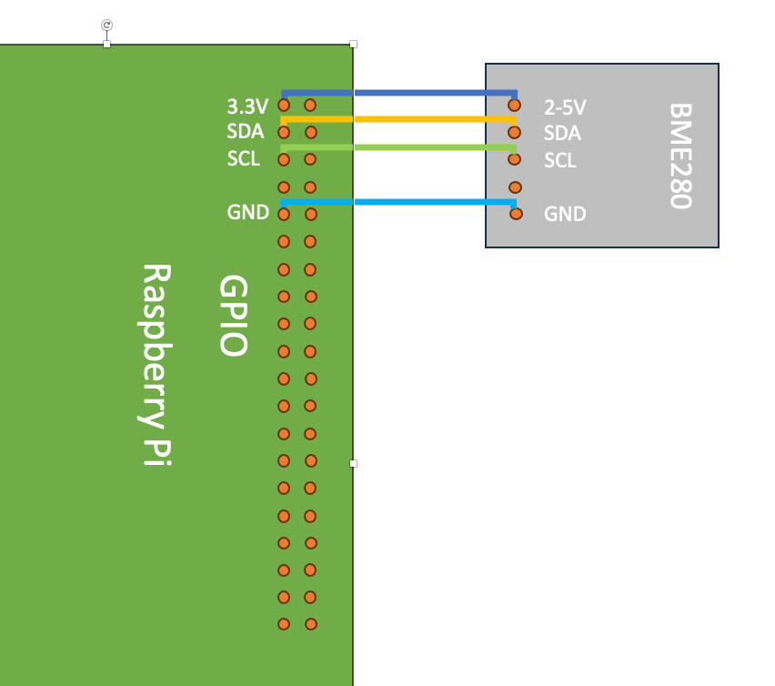

# Setup instructions for a new Raspberry Pi

You will first need to make an SD card image for the operating system using the Raspberry Pi Imager downloaded from the Raspberry Pi [website](https://www.raspberrypi.com/software/).

After you've opened the Imager app, click on “CHOOSE OS” and from the menu choose the 'Raspberry Pi OS (64bit)'.   Note that the ArcGIS Maps SDK for Java libraries will not work with 32bit operating systems.

Once the Imaging process is complete, put the SD card in the Raspberry Pi and follow the setup instructions where you will set a username, password and connect to a network if available.

Once the Raspberry Pi is up and running, then open up the Terminal and follow the steps below:

- Perform a system upgrade with `sudo apt-get update`, then`sudo apt full-upgrade`

- Install Java with `sudo apt install openjdk-17-jdk -y`

- Install maven with `sudo apt install maven -y`

- Obtain the early adopter zip distribution of the ArcGIS Maps SDK for Java.
- Unzip the file and run the script `./install-local.sh`

- Create a `dev` directory in your home for working with git repositories with `mkdir dev`
- Move into the dev directory with `cd dev`
- Connect the weather sensor to your Raspberry Pi



- Clone the python library for reading the Pimoroni BME280 with `git clone https://github.com/pimoroni/bme280-python.git`
- Follow the setup [instructions](https://github.com/pimoroni/bme280-python/tree/master#readme) for the BME280 library
- You can now test that your BME280 sensor is working using the `all_values.py` script as shown below:

```
mark@raspberrypi:~/dev/bme280-python/examples $ ./all-values.py 
all-values.py - Read temperature, pressure, and humidity

Press Ctrl+C to exit!


21.14*C 682.86hPa 63.41%
23.25*C 1000.02hPa 45.52%
23.26*C 1000.03hPa 45.53%
23.26*C 1000.03hPa 45.52%
23.27*C 1000.03hPa 45.52%
23.27*C 1000.04hPa 45.48%
```

Optionally for remote access to the Raspberry Pi, you may want to configure VNC access to the machine.

You should now be able to run the weather station app in this repository!